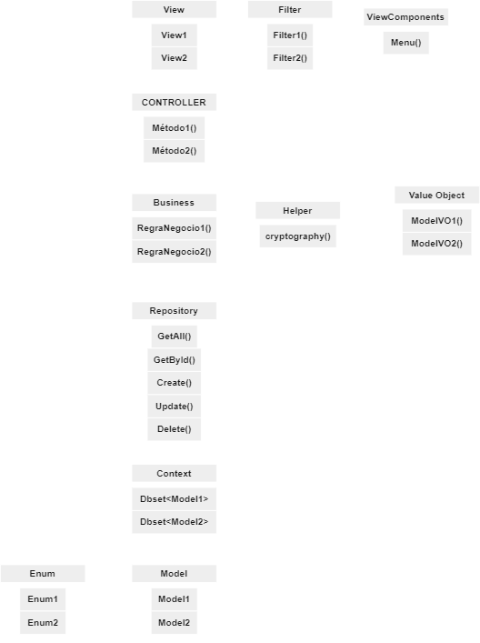

  

---

A aplicação é um sistema de gerenciamento de documentos especializado em Relatórios Diários de Obra (RDO). O propósito principal do sistema é facilitar o controle e o envio de RDOs de acordo com o fiscal e a obra associada a cada relatório. Ele fornece uma plataforma organizada para administrar os envios de RDOs e o controle das respectivas assinaturas dos fiscais responsáveis.
---
